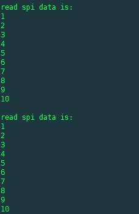

# pi_spi_test
测试树莓派 spi C 接口c

> [参考 树莓派wiringPi库详解](https://www.cnblogs.com/lulipro/p/5992172.html)
> 
> [参考 树莓派spi通信](https://blog.csdn.net/yichu5074/article/details/83387474)

输入

```
gcc -Wall -o test test.c  -lwiringPi
```

得到运行结果

